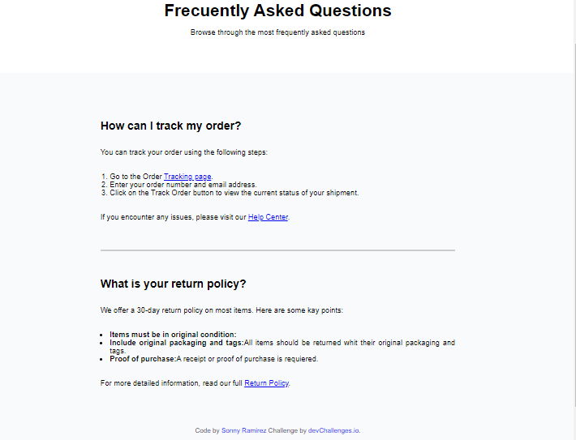

<h1 align="center">Preguntas Frecuentes | devChallenges</h1>

   Solution for a challenge <a href="https://devchallenges.io/challenge/simple-faq-challenge" target="_blank">Simple FAQ</a> from <a href="http://devchallenges.io" target="_blank">devChallenges.io</a>.

  <h3>
    <a href="{https://your-demo-link.your-domain}">
      Demo
    </a>
     | 
    <a href="{https://your-url-to-the-solution}">
      Solution
    </a>
     | 
    <a href="https://devchallenges.io/challenge/simple-faq-challenge">
      Challenge
    </a>
  </h3>

## Table of Contents

- [Overview](#overview)
  - [What I learned](#what-i-learned)
  - [Useful resources](#useful-resources)
- [Built with](#built-with)
- [Features](#features)
- [Contact](#contact)
- [Acknowledgements](#acknowledgements)

## Overview

Este proyecto es sobre una seria de preguntas seguidas de su respuesta sobre la politica de devolucion y como pueden recoger su orden

### What I learned

Pude aprender a trabajar de manera mas eficiente, anteriormente realizaba ejercicios puestos por mi mismo sin rumbo alguno, con estos proyectos puedo aprender de manera precisa y objetiva con desafios de manera correcta. Aprendi a realizar un sitio mas ordenado y limpio para que sea comodo para el usuario. Aprendi a usar distintas herramientas en html y css.
 

### Useful resources

<a href="https://chatgpt.com">ChatGPT</a>Es uno de los elementos que me apoyo para poder realizarlo.

Mimo es una aplicacion que tambien me a apoyado muchisimo para aprender programacion front-end.

### Built with

- Semantic HTML5 markup
- CSS custom properties

## Features

En mi proyecto se encuentra el uso de HTML para una mejor accesibilidad y SEO. Diseño adaptable a móviles, tabletas y computadoras. Despliegue en Netlify para acceso en línea.

This application/site was created as a submission to a [DevChallenges](https://devchallenges.io/challenges-dashboard) challenge.

## Acknowledgements

DevChallenges.io me apoyo a poder aprender mas y de forma mas formal. Mimo.org me apoyo a aprender despacio y sencillo y algunos tutoriales de youtube e instagram.

## Author

- Website [your-website.com](https://{your-web-site-link})
- GitHub [@S-arz84](https://github.com/S-arz84)